# The Daily Reflection Tree — Visual Diagram

```mermaid
flowchart TD
    START["🌙 START\nGood evening..."]
    
    subgraph AXIS1["Axis 1: Locus — Victim vs Victor"]
        A1_OPEN["❓ A1_OPEN\nDescribe today in one word?\n(Challenging | Productive | Draining | Steady)"]
        A1_D1{"🔀 A1_D1\nRoutes by answer"}
        A1_Q1_POS["❓ A1_Q1_POS\nWhat made things go well?\n(4 options → internal/external)"]
        A1_Q1_NEG["❓ A1_Q1_NEG\nFirst instinct when things got hard?\n(4 options → internal/external)"]
        A1_Q2["❓ A1_Q2\nSomething didn't go as planned. What did you do?\n(4 options → internal/external)"]
        A1_D_REFLECT{"🔀 A1_D_REFLECT\nRoutes by axis1 dominant"}
        A1_R_INT["💡 A1_R_INT\nYou see your hand in how\nthings played out."]
        A1_R_EXT["💡 A1_R_EXT\nToday felt out of your hands —\nbut you still made a call."]
        A1_R_MIX["💡 A1_R_MIX\nYou held both —\ndriver and driven."]
    end

    BRIDGE_1_2["🌉 BRIDGE_1_2\nShift: what did you put into the day?"]

    subgraph AXIS2["Axis 2: Orientation — Contribution vs Entitlement"]
        A2_OPEN["❓ A2_OPEN\nOne interaction today — what happened?\n(4 options → contribution/entitlement)"]
        A2_D1{"🔀 A2_D1\nRoutes by answer"}
        A2_Q1_CONT["❓ A2_Q1_CONT\nWhat motivated you to lean in?\n(4 options → contribution/entitlement)"]
        A2_Q1_ENT["❓ A2_Q1_ENT\nPut in vs got back — how does it sit?\n(4 options → contribution/entitlement)"]
        A2_Q2["❓ A2_Q2\nColleague had a harder day — your reaction?\n(4 options → contribution/entitlement)"]
        A2_D_REFLECT{"🔀 A2_D_REFLECT\nRoutes by axis2 dominant"}
        A2_R_CONT["💡 A2_R_CONT\nEnergy went outward.\nGiving without score."]
        A2_R_ENT["💡 A2_R_ENT\nTracking the ledger.\nIs the counting costing you?"]
        A2_R_MIX["💡 A2_R_MIX\nSome giving, some weighing.\nBoth are real."]
    end

    BRIDGE_2_3["🌉 BRIDGE_2_3\nLast shift: who was in the frame?"]

    subgraph AXIS3["Axis 3: Radius — Self-Centrism vs Altrocentrism"]
        A3_OPEN["❓ A3_OPEN\nToday's biggest challenge — who comes to mind?\n(4 options → self/others/transcendent)"]
        A3_D1{"🔀 A3_D1\nRoutes by answer"}
        A3_Q1_SELF["❓ A3_Q1_SELF\nAnyone else affected?\n(4 options → self/others)"]
        A3_Q1_OTHERS["❓ A3_Q1_OTHERS\nWhat pulled your attention beyond yourself?\n(4 options → others/transcendent)"]
        A3_Q2["❓ A3_Q2\nMessage to someone downstream?\n(4 options → self/others/transcendent)"]
        A3_D_REFLECT{"🔀 A3_D_REFLECT\nRoutes by axis3 signals"}
        A3_R_SELF["💡 A3_R_SELF\nFrame stayed close.\nNarrow isn't wrong."]
        A3_R_OTHERS["💡 A3_R_OTHERS\nAwareness extended past\nyourself today."]
        A3_R_TRANS["💡 A3_R_TRANS\nHeld the bigger picture —\npurpose, downstream impact."]
    end

    SUMMARY["📊 SUMMARY\nHere's what today's reflection surfaced...\n(axis1 + axis2 + axis3 synthesis)"]
    END["🌙 END\nSee you tomorrow evening."]

    %% Flow connections
    START --> A1_OPEN
    A1_OPEN --> A1_D1
    A1_D1 -->|"Productive / Steady"| A1_Q1_POS
    A1_D1 -->|"Challenging / Draining"| A1_Q1_NEG
    A1_Q1_POS --> A1_Q2
    A1_Q1_NEG --> A1_Q2
    A1_Q2 --> A1_D_REFLECT
    A1_D_REFLECT -->|"internal dominant"| A1_R_INT
    A1_D_REFLECT -->|"external dominant"| A1_R_EXT
    A1_D_REFLECT -->|"mixed"| A1_R_MIX
    A1_R_INT --> BRIDGE_1_2
    A1_R_EXT --> BRIDGE_1_2
    A1_R_MIX --> BRIDGE_1_2

    BRIDGE_1_2 --> A2_OPEN
    A2_OPEN --> A2_D1
    A2_D1 -->|"helped / shared"| A2_Q1_CONT
    A2_D1 -->|"not acknowledged / others slack"| A2_Q1_ENT
    A2_Q1_CONT --> A2_Q2
    A2_Q1_ENT --> A2_Q2
    A2_Q2 --> A2_D_REFLECT
    A2_D_REFLECT -->|"contribution dominant"| A2_R_CONT
    A2_D_REFLECT -->|"entitlement dominant"| A2_R_ENT
    A2_D_REFLECT -->|"mixed"| A2_R_MIX
    A2_R_CONT --> BRIDGE_2_3
    A2_R_ENT --> BRIDGE_2_3
    A2_R_MIX --> BRIDGE_2_3

    BRIDGE_2_3 --> A3_OPEN
    A3_OPEN --> A3_D1
    A3_D1 -->|"Just me"| A3_Q1_SELF
    A3_D1 -->|"Team / Person / Users"| A3_Q1_OTHERS
    A3_Q1_SELF --> A3_Q2
    A3_Q1_OTHERS --> A3_Q2
    A3_Q2 --> A3_D_REFLECT
    A3_D_REFLECT -->|"transcendent ≥ 1"| A3_R_TRANS
    A3_D_REFLECT -->|"others dominant"| A3_R_OTHERS
    A3_D_REFLECT -->|"default: self"| A3_R_SELF
    A3_R_SELF --> SUMMARY
    A3_R_OTHERS --> SUMMARY
    A3_R_TRANS --> SUMMARY

    SUMMARY --> END

    %% Styling
    classDef startEnd fill:#1a1a2e,stroke:#e2b714,stroke-width:2px,color:#f5f5f5
    classDef question fill:#16213e,stroke:#0f3460,stroke-width:2px,color:#e4e4e4
    classDef decision fill:#0f3460,stroke:#e94560,stroke-width:2px,color:#e4e4e4
    classDef reflection fill:#1a1a2e,stroke:#53a653,stroke-width:2px,color:#c5e8c5
    classDef bridge fill:#2d2d44,stroke:#e2b714,stroke-width:1px,color:#e2b714
    classDef summary fill:#1a1a2e,stroke:#e2b714,stroke-width:3px,color:#e2b714

    class START,END startEnd
    class A1_OPEN,A1_Q1_POS,A1_Q1_NEG,A1_Q2,A2_OPEN,A2_Q1_CONT,A2_Q1_ENT,A2_Q2,A3_OPEN,A3_Q1_SELF,A3_Q1_OTHERS,A3_Q2 question
    class A1_D1,A1_D_REFLECT,A2_D1,A2_D_REFLECT,A3_D1,A3_D_REFLECT decision
    class A1_R_INT,A1_R_EXT,A1_R_MIX,A2_R_CONT,A2_R_ENT,A2_R_MIX,A3_R_SELF,A3_R_OTHERS,A3_R_TRANS reflection
    class BRIDGE_1_2,BRIDGE_2_3 bridge
    class SUMMARY summary
```

## Legend

| Symbol | Node Type | Behavior |
|--------|-----------|----------|
| 🌙 | Start / End | Auto-advances |
| ❓ | Question | Waits for employee to pick an option |
| 🔀 | Decision | Invisible routing — evaluates rules, auto-advances |
| 💡 | Reflection | Shows insight — employee clicks Continue |
| 🌉 | Bridge | Transitions between axes — auto-advances |
| 📊 | Summary | Synthesizes the full path taken |

## Path Count

- **Axis 1 branches:** 2 paths (positive/negative day) × 3 reflections = 6 paths
- **Axis 2 branches:** 2 paths (contribution/entitlement) × 3 reflections = 6 paths  
- **Axis 3 branches:** 2 paths (self/others) × 3 reflections = 6 paths
- **Total unique full paths:** 6 × 6 × 6 = **216 distinct conversation paths**

Every path is fully deterministic — same answers always produce the same conversation.
